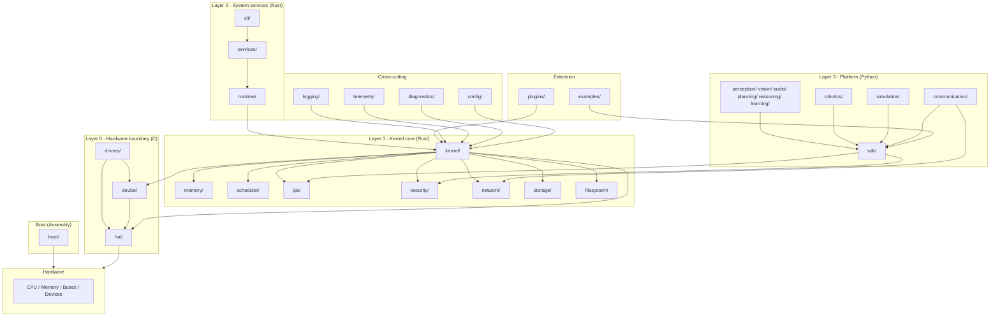

# AEOS Master Architecture Document

> **Status:** normative · **Owner:** Architecture Council
> This is the authoritative design reference for the
> **Ajeeb Embodied AI Operating System**. Every directory, boundary, and rule
> below is binding. Changes require an ADR (`docs/adr/`).

---

## 1. Vision and design principles

AEOS is a 15+ year operating system for embodied artificial intelligence: one
platform that runs virtual agents, humanoid robots, industrial robots,
autonomous vehicles, drones, and future AI hardware.

It is engineered like a real OS — because it is one: a kernel, a scheduler, a
memory manager, an IPC fabric, a driver model, a filesystem, a network stack —
with an AI runtime layered on top, and a plugin economy around the whole.

### 1.1 Principles (in order of precedence)

1. **Never mix responsibilities.** One subsystem, one language, one job. The
   language boundary is an architectural boundary, and it is enforced by tooling.
2. **Safety by construction.** Rust owns the trusted core. `unsafe` is a
   reviewed, counted, and tool-audited exception. C exists only below the
   HAL/driver line. Assembly exists only where the ABI demands it.
3. **Clean Architecture.** Dependencies point inward. The domain logic of every
   subsystem is pure; hardware, frameworks, and the outside world sit behind
   ports.
4. **Hexagonal (Ports & Adapters).** Every subsystem is a hexagon: domain core,
   ports (interfaces), adapters (implementations). Swapping an adapter (a
   physics engine, a sensor, a network transport) never touches domain code.
5. **Domain-Driven Design.** Each top-level directory is a bounded context with
   its own ubiquitous language, entities, and error taxonomy. Contexts
   communicate through the IPC fabric — never through shared internals.
6. **Event-driven by default.** Subsystems observe, never couple. State changes
   are events; commands are messages. CQRS is applied wherever reads and
   writes have different shapes or rates.
7. **Composition over inheritance.** Everywhere, in every language. Inheritance
   is reserved for error types only.
8. **Dependency injection.** Nothing constructs its own dependencies. The
   composition root of each subsystem is explicit and boot-time-validated.
9. **Extensible by plugins, not by forks.** The plugin runtime and ABI are
   first-class citizens from day one.
10. **Research-grade and production-grade at once.** Deterministic replay,
    seeds, run IDs, and telemetry are features with owners — and so are
    performance budgets, audits, and crash dumps.

### 1.2 What we learned from the giants

| Inspiration | What AEOS takes |
|---|---|
| Linux | Monolithic kernel pragmatism; layered driver model; SMP scheduling |
| Windows NT | Kernel/driver boundary discipline; device model; error codes |
| seL4 | Capability-based authorization; formalizable security design |
| ROS2 | DDS-style typed pub/sub messaging; node model; sim/hardware parity |
| Modern AI platforms | Model registry, token/RT budgets, reproducible runs |

### 1.3 Kernel model decision (ADR-0002)

AEOS uses a **modular monolithic kernel** with a **capability-based security
model**:

- Performance and simplicity of a monolithic kernel; isolation of a capability
  system for authorization; NT-style driver model so drivers are replaceable
  and, in later phases, movable to user space.
- The kernel owns: process/thread management, address spaces, scheduling,
  IPC, interrupts, syscalls.
- Drivers run kernel-side behind the HAL in Phase 1; the **user-space driver
  framework** is a designed extension point, not a rewrite (ADR-0002).

---

## 2. Language strategy and boundaries

> One directory, one primary language. Cross-language calls happen only at
> declared, versioned FFI boundaries — nothing else.

| Concern | Language | Where | Why |
|---|---|---|---|
| Bootloader, CPU init, arch startup | Assembly | `boot/` | ABI-true, zero-runtime start |
| Context switching, trap entry | Assembly (only) | `kernel/src/arch/<arch>/` | ABI-critical, must not be compiler-managed |
| Kernel, runtime, scheduler, memory mgr, IPC, networking, security, plugin runtime, storage, filesystem, services, CLI, telemetry/logging/diagnostics core | Rust | `kernel/ runtime/ memory/ scheduler/ ipc/ security/ network/ plugins/ storage/ filesystem/ services/ cli/ logging/ telemetry/ diagnostics/` | Memory safety at the trust boundary |
| Hardware abstraction, drivers, device model, embedded support | C | `hal/ drivers/ device/` | Direct hardware ABI, wide toolchain reach, embedded reality |
| AI runtime, vision, audio, learning, planning, reasoning, simulation, robotics, communication adapters, developer SDK | Python | `perception/ vision/ audio/ planning/ reasoning/ learning/ simulation/ robotics/ communication/ sdk/` | AI ecosystem velocity, research ergonomics |
| System-wide configuration schemas | TOML | `config/` | Language-neutral, human-writable |

### 2.1 FFI boundary rules (the Constitution)

1. **Python never touches hardware.** Python subsystems talk to the kernel
   only through `sdk/` — the single sanctioned FFI + protocol boundary.
2. **Rust kernel touches hardware only through C.** `hal/` headers
   (`aeos_hal.h`, `aeos_driver.h`, `aeos_device.h`) are the contract; the Rust
   side consumes them via `kernel/ffi/` (generated from the headers, never
   hand-written twice).
3. **C code never sees Rust types.** The Rust side owns all kernel object
   lifetimes; C sees opaque handles (`aeos_handle_t`) plus a fixed C ABI.
4. **Assembly appears in exactly two places:** `boot/` (boot phase) and
   `kernel/src/arch/<arch>/` (trap + context-switch trampolines). Nothing else
   may contain assembly; CI greps for it.
5. **Error translation happens at the boundary.** Every FFI function returns
   `aeos_errno_t` (C ABI) or a `Result` (Rust) / typed exception (Python);
   domain errors never leak raw pointers or exceptions across languages
   (§9.2).
6. **No shared mutable globals across languages.** State crosses boundaries as
   messages, shared-memory rings, or explicit handles.

---

## 3. Complete directory tree

```
aeos/                                  # repository root (workspaces + docs)
├── boot/                              # Assembly boot phase
│   ├── x86_64/                        #   BIOS/UEFI entry, multiboot2 (NASM)
│   ├── aarch64/                       #   early boot (GAS)
│   └── riscv64/                       #   early boot (GAS)
├── kernel/                            # Rust — the trusted core
│   ├── src/                           #   processes, threads, syscalls, interrupts
│   │   └── arch/{x86_64,aarch64,riscv64}/  # trap entry + context switch (asm)
│   ├── ffi/                           #   extern "C" bindings to hal/device
│   ├── tests/                         #   kernel unit + integration tests
│   └── benches/
├── runtime/                           # Rust — userland runtime & async executor
├── memory/                            # Rust — physical/virtual memory manager
├── scheduler/                         # Rust — scheduling policies, RT, SMP
├── ipc/                               # Rust — channels, shared memory, event bus
├── security/                          # Rust — capabilities, auth, audit, crypto
├── network/                           # Rust — protocol stack, sockets
├── drivers/                           # C — concrete device drivers
│   ├── include/                       #   public driver API (aeos_driver.h)
│   ├── src/bus/                       #   PCIe, USB, I2C, SPI, CAN, UART, ETH
│   └── src/device/                    #   sensors, actuators, displays, storage
├── hal/                               # C — hardware abstraction layer
│   ├── include/                       #   aeos_hal.h: interrupts, timer, MMIO, DMA
│   └── src/arch/                      #   per-architecture implementations
├── device/                            # C — device model, registry, device tree
├── perception/                        # Python — multimodal perception runtime
├── vision/                            # Python — computer vision pipelines
├── audio/                             # Python — audio & speech pipelines
├── planning/                          # Python — task & motion planning
├── reasoning/                         # Python — LLM/VLM inference, knowledge
├── learning/                          # Python — RL, imitation, skill acquisition
├── simulation/                        # Python — physics backends, scenarios
├── robotics/                          # Python — motion control, kinematics, state est.
├── communication/                     # Python — external protocols (ROS2, MQTT, ...)
├── plugins/                           # Rust — plugin runtime + ABI
│   ├── api/                           #   plugin ABI types & versioning
│   └── runtime/                       #   WASM sandbox host, native loader
├── sdk/                               # Python — developer SDK + FFI bindings
│   ├── py/                            #   the aeos_sdk Python package
│   └── bindings/                      #   PyO3 extension, C client, protocol stubs
├── cli/                               # Rust — aeosctl system control & diagnostics
├── config/                            # TOML schemas, profiles, validation
├── logging/                           # Rust core + Python bindings
├── telemetry/                         # Rust core + Python bindings (OTel)
├── diagnostics/                       # Rust + Python — crash dumps, health, profiling
├── storage/                           # Rust — block/object/KV storage stack
├── filesystem/                        # Rust — VFS, mounts, filesystems
├── services/                          # Rust — init, service registry, health, updates
├── tools/                             # Rust + shell — build, cross, flash, debug
├── examples/                          # worked examples per language
├── docs/                              # documentation (this tree is the source)
│   ├── architecture/                  #   master doc, communication, plugins, build
│   ├── adr/                           #   architecture decision records
│   ├── guides/                        #   how-tos
│   └── api/                           #   generated + curated API reference
├── tests/                             # cross-language test suites
│   ├── kernel/  hal/  drivers/        #   low-level
│   ├── sdk/     ai/                   #   platform layer
│   ├── contract/                      #   port contract suites (every adapter)
│   ├── e2e/                           #   full-system scenarios in emulation
│   ├── fuzz/                          #   fuzzing targets
│   └── hil/                           #   hardware-in-the-loop (gated runners)
├── benchmarks/                        # cross-language benchmark suites
└── [root] Cargo.toml, uv.toml, pyproject.toml, Makefile, rust-toolchain.toml
```

### 3.1 Why every directory exists

| Directory | Language | Why it exists (single responsibility) |
|---|---|---|
| `boot/` | Assembly | Bring the CPU from power-on to the first Rust instruction: bootloader, CPU/memory init, arch startup. Nothing else may run before it. |
| `kernel/` | Rust | The trusted core: processes, threads, syscalls, interrupts, trap dispatch, address-space operations. The only code that never trusts another component. |
| `runtime/` | Rust | The userland runtime: async executor, task model, thread pools, the ABI between a program and the kernel. Makes kernel services ergonomic without entering the kernel. |
| `memory/` | Rust | Physical frame management (buddy allocator), virtual memory, paging, COW, mmap, kernel heap, memory quotas. One owner for all memory policy. |
| `scheduler/` | Rust | Which thread runs when, on which core: priority + fair + real-time classes, SMP load balancing, preemption policy. Policy is isolated from mechanism. |
| `ipc/` | Rust | The communication fabric of the OS: typed message channels, shared-memory rings (zero-copy), the system event bus, and the syscall ABI that carries them. |
| `security/` | Rust | Capabilities, authentication, authorization, audit, cryptography, secrets. Every privilege decision in the system passes through one module. |
| `network/` | Rust | Protocol stack (IPv4/IPv6, UDP, TCP), sockets, and their exposure to the SDK. Hardware lives in `drivers/`; policy lives here. |
| `drivers/` | C | Concrete device drivers: buses (PCIe, USB, I2C, SPI, CAN, UART, Ethernet) and devices (sensors, actuators, displays, storage). One driver, one device class. |
| `hal/` | C | The portable hardware abstraction layer: interrupts, timers, MMIO, DMA, serial console. The single contract between the Rust kernel and all hardware. |
| `device/` | C | The device model: registry, discovery, device tree (FDT), capability descriptors. `drivers/` register here; the kernel queries here. |
| `perception/` | Python | Multimodal fusion of vision, audio, and proprioception into a timestamped, confidence-bearing world model. Integration point for the sensory AI. |
| `vision/` | Python | Computer vision pipelines: detection, segmentation, tracking, depth. One modality; no business logic. |
| `audio/` | Python | Audio and speech pipelines: capture, ASR, TTS, sound events. One modality; no business logic. |
| `planning/` | Python | Goals → verified plans: symbolic, learned, and LLM-assisted planners behind one port; replanning policy. |
| `reasoning/` | Python | AI model runtime: LLM/VLM inference, token budgets, prompt management, knowledge/symbolic reasoning. All model access flows through here. |
| `learning/` | Python | Skill acquisition: RL, imitation, curriculum, experience buffers, experiment tracking. Never compromises safety or determinism. |
| `simulation/` | Python | Physics worlds (MuJoCo, Isaac, Gazebo as adapters), scenario runner, telemetry recording, sim-to-real. Simulation is a first-class hardware provider. |
| `robotics/` | Python | Robot control frameworks: kinematics, trajectory generation, motion control, state estimation, safety limits. The domain layer above HAL. |
| `communication/` | Python | The authenticated boundary to the outside world: ROS2, MQTT, gRPC, WebSocket adapters. All external I/O transits this module. |
| `plugins/` | Rust | The plugin runtime: manifest, verification, WASM sandbox, native loader, lifecycle, ABI versioning. The extension economy of the OS. |
| `sdk/` | Python | The developer SDK: `aeos_sdk` Python package, FFI bindings to kernel services, protocol stubs. The only way Python reaches the kernel. |
| `cli/` | Rust | `aeosctl`: system control, service management, diagnostics, configuration — the operator's interface to the OS. |
| `config/` | TOML | Layered, schema-validated, versioned configuration for every subsystem. Configuration is a deployment artifact, not code. |
| `logging/` | Rust | Structured logging core (lock-free ring, JSON lines, correlation IDs) with Python bindings. Logging never blocks the hot path. |
| `telemetry/` | Rust | Metrics and distributed traces (OpenTelemetry): counters, histograms, exporters. Telemetry is sampled, budgeted, and observable. |
| `diagnostics/` | Rust | Crash dumps, health checks, panic/exception capture, profiling hooks. Everything needed to answer "what happened" after a fault. |
| `storage/` | Rust | The storage stack: block devices, volumes, object store, key-value store. Hardware access goes through `hal/`; naming goes to `filesystem/`. |
| `filesystem/` | Rust | The virtual filesystem: mounts, paths, permissions, and filesystem implementations. The user-visible byte store of the OS. |
| `services/` | Rust | System services: init/launcher, service registry, health monitoring, update orchestration. The OS as a set of supervised, replaceable daemons. |
| `tools/` | Rust | Developer tooling: build orchestration, cross-compilation, image assembly, flashing, debugging. Everything that makes the OS buildable. |
| `examples/` | all | Worked, compilable examples per language — the first thing a new developer reads. |
| `docs/` | — | The documentation system: architecture, ADRs, guides, API reference. Docs are buildable, reviewed, and versioned with the code. |
| `tests/` | all | Cross-language verification: kernel, HAL, drivers, SDK, AI, contract, e2e, fuzz, HIL. Organized by layer, not by language. |
| `benchmarks/` | all | Cross-language performance suites with regression thresholds. Performance is a contract, not an aspiration. |

---

## 4. Dependency graph

### 4.1 Module-level graph

Convention: `A --> B` means **A depends on B** (arrow points at the
dependency). Subsystem crates of the kernel are listed in
`kernel/`'s Cargo workspace and are reached through ports — never through
kernel internals.



### 4.2 The five rules that keep the graph acyclic

1. **Python only depends on `sdk/` and its own sibling AI modules.** No Python
   module imports Rust or C symbols directly; FFI exists only in `sdk/`.
2. **Rust never depends on Python.** Direction is one-way; the SDK is the
   bridge.
3. **C depends only on `hal/`, `device/`, and `boot/` headers.** A driver never
   includes kernel headers; the kernel never includes driver headers.
4. **Subsystem crates never import `aeos-kernel`.** They expose ports; the
   kernel composition root wires them (dependency inversion, same rule as the
   Python layer).
5. **`cli/`, `services/`, `plugins/`, `examples/` are consumers only.** Nothing
   imports them.

Enforcement (see CODE_STYLE §8): `cargo-deny` + custom CI boundary checks,
`include-what-you-use` for C, `import-linter` for Python, and a repo-wide
import-boundary test in `tests/contract/`.

### 4.3 FFI boundary table (the only sanctioned crossings)

| Boundary | Source | Target | Contract |
|---|---|---|---|
| Boot → Kernel | `boot/` asm | `kernel/` Rust | ABI entry point (`aeos_boot_entry`), kernel ABI structs |
| Kernel → HAL | `kernel/ffi/` (Rust) | `hal/include/` (C) | `aeos_hal.h` — interrupts, timer, MMIO, DMA, console |
| Kernel → Device model | `kernel/ffi/` (Rust) | `device/include/` (C) | `aeos_device.h` — registry, capabilities, device tree |
| Drivers → HAL | `drivers/src/` (C) | `hal/include/` (C) | `aeos_hal.h` |
| Drivers → Device model | `drivers/src/` (C) | `device/include/` (C) | `aeos_driver.h` registration API |
| SDK → Kernel | `sdk/bindings/` (Rust ext + C client) | `ipc/` + syscall ABI (Rust) | versioned protocol schema (see COMMUNICATION.md) |
| Logging/Telemetry/Diagnostics → all | Rust core | any Rust crate | crates `aeos-logging`, `aeos-telemetry`, `aeos-diagnostics` |
| Logging/Telemetry/Diagnostics → Python | `logging/bindings/` etc. (Python) | `sdk/py/` | same packages re-exported via SDK |

---

## 5. Module responsibilities (detailed)

### 5.1 Boot layer

| Dir | Responsibilities | Non-responsibilities |
|---|---|---|
| `boot/x86_64` | BIOS/UEFI entry, multiboot2, long-mode setup, early paging, hand-off to `kernel` | Anything after the Rust entry point |
| `boot/aarch64`, `boot/riscv64` | Same role per architecture (staged bring-up) | — |

### 5.2 Kernel core (Rust)

| Dir | Responsibilities | Non-responsibilities |
|---|---|---|
| `kernel/` | Process/thread objects, syscalls, interrupt/trap dispatch, address spaces, kernel debug facilities | Scheduling policy (→ `scheduler/`), memory policy (→ `memory/`), device policy (→ `device/` + `drivers/`) |
| `kernel/ffi/` | `extern "C"` bindings to `aeos_hal.h`/`aeos_device.h`, error translation | Hand-written duplicates of header content |
| `kernel/src/arch/<arch>/` | Trap entry, context switching, TLB flush helpers (assembly + minimal Rust) | Any business logic |

### 5.3 System subsystems (Rust)

| Dir | Responsibilities | Ports provided (consumed via DI) |
|---|---|---|
| `memory/` | Buddy frame allocator, VMA management, paging, COW, mmap, kernel heap, quotas | `FrameAllocator`, `Vmm`, `MemoryBudget` |
| `scheduler/` | Runqueues, priorities, RT classes, SMP balancing, preemption, deadlines | `SchedulerPolicy`, `ThreadQueue` |
| `ipc/` | Channels (bounded, typed), shared-memory rings, system event bus, syscall ABI | `Channel`, `SharedRing`, `EventBus` |
| `security/` | Capabilities, principals, policy engine, audit log, crypto, secrets | `CapabilityManager`, `AuditSink`, `Keyring` |
| `network/` | IPv4/IPv6, UDP/TCP, sockets, interface abstraction | `SocketProvider`, `InterfaceDriver` |
| `storage/` | Block/object/KV backends, volumes, quotas | `BlockDevice`, `ObjectStore`, `KvStore` |
| `filesystem/` | VFS, mounts, paths, permissions, FS implementations | `Vfs`, `Filesystem` |
| `runtime/` | Async executor, task model, thread pools, ABI layer for user programs | `Executor`, `TaskSpawner` |

### 5.4 System services (Rust)

| Dir | Responsibilities | Non-responsibilities |
|---|---|---|
| `services/` | `init` (launch order), service registry, health supervisor, update orchestration | Application logic (→ Python layer) |
| `cli/` | `aeosctl`: system state, service control, config editing, diagnostics, repl | AI functionality |

### 5.5 Hardware boundary (C)

| Dir | Responsibilities | Non-responsibilities |
|---|---|---|
| `hal/` | Portable C API for interrupts, timers, MMIO, DMA, cache ops, console; arch implementations | Device-specific logic |
| `drivers/` | Bus drivers + concrete device drivers implementing HAL interfaces; probe/init/ioctl/open/close; interrupt handlers | Kernel policy, AI logic |
| `device/` | Registry, discovery, device tree (FDT), capability descriptors, hot-plug events | Driver implementations |

### 5.6 Platform layer (Python)

| Dir | Responsibilities | Non-responsibilities |
|---|---|---|
| `sdk/` | `aeos_sdk` package, FFI extension, async client for IPC, security client, examples | Business logic |
| `perception/` | Sensor fusion, world model, confidence, timestamping | Single-modality algorithms (→ `vision/`, `audio/`) |
| `vision/` | Detection, segmentation, tracking, depth pipelines | Fusion (→ `perception/`) |
| `audio/` | Capture, ASR, TTS, sound-event pipelines | Fusion (→ `perception/`) |
| `planning/` | Task planning, motion planning interfaces, replanning, plan validation | Execution (→ `robotics/`), reasoning internals |
| `reasoning/` | Model gateway, token budgets, prompt management, knowledge reasoning | Task decomposition (→ `planning/`) |
| `learning/` | RL, imitation, experience buffers, curriculum, experiment tracking | Serving learned policies (→ `robotics/`/`planning/`) |
| `simulation/` | Physics adapters, scenario runner, telemetry recorder, sim-to-real | Agent logic |
| `robotics/` | Kinematics, trajectory generation, motion control, state estimation, safety envelopes | Physics (→ `simulation/`) |
| `communication/` | ROS2/MQTT/gRPC/WebSocket adapters, message validation, audit | Transport internals (→ `network/`) |

### 5.7 Cross-cutting

| Dir | Responsibilities |
|---|---|
| `config/` | TOML schemas, layered loading, validation, `schema_version`, profile system, secret references |
| `logging/` | Structured JSON events, correlation IDs, per-subsystem levels, lock-free hot path, redaction |
| `telemetry/` | OTel metrics/traces, sampling, exporters, budget enforcement |
| `diagnostics/` | Crash dumps, panic capture, health checks, profiling, replay archives |
| `plugins/` | Runtime, sandbox, manifests, permissions, ABI versioning, quarantine |
| `tools/` | Build orchestration, cross-compilation, image assembly, flash, debug |
| `examples/` | Runnable examples per language demonstrating the SDK and the driver model |
| `docs/` | Architecture, ADRs, guides, API reference |
| `tests/`, `benchmarks/` | Cross-language verification and performance suites |

---

## 6. Cross-cutting architecture summaries

| Concern | Decision (details) |
|---|---|
| Error handling | Single taxonomy `AEOS-<MOD>-<NNN>` across all languages; C errno enum, Rust `Result`, Python typed exceptions; translation only at FFI boundaries (§9.2; CODE_STYLE §4) |
| Configuration | TOML, layered (defaults → profile → env → CLI), schema-versioned, validated, immutable post-boot; secrets by reference only (`config/`) |
| Logging | Structured JSON; correlation ID propagated across languages; async sink; sampled hot paths (`logging/`) |
| Telemetry | OpenTelemetry; kernel-side lock-free counters; budgeted sampling (`telemetry/`) |
| Diagnostics | Panic/exception capture → crash dump; health API; deterministic replay of runs (`diagnostics/`) |
| Security | Capability-based; least privilege; audit everywhere; TLS 1.3; signed artifacts (`security/`, SECURITY.md) |
| Memory safety | Rust trusted core; `unsafe` counted and reviewed; C confined below HAL line; ASLR/NX/stack-protector in kernel build |
| Testing | Pyramid per layer; contract tests for every port; QEMU e2e; HIL gate (TESTING.md) |
| Performance | Budgets are contracts; benchmarks in CI with thresholds; zero-copy IPC; no allocation in IRQ context (CODE_STYLE §12) |

---

## 7. Subsystem conventions

1. Every Rust subsystem is a Cargo crate in the `aeos` workspace, `#![forbid(unsafe_code)]` unless it is a listed exception.
2. Every C subsystem builds with CMake, exports `aeos_*.h`, and is MISRA-aligned.
3. Every Python subsystem is a `uv` workspace member, src-layout, fully typed.
4. Every subsystem exposes ports (interfaces) before adapters; contract tests come with the port.
5. Every subsystem has a README with: responsibility, language, public API, dependencies, error codes, events, tests (see per-directory READMEs).
6. Every subsystem owns its error codes; codes are unique project-wide and listed in the README.
7. New subsystems require an ADR, a contract test suite, and a composition-root wiring.

---

## 8. Related documents

| Document | Covers |
|---|---|
| `docs/architecture/COMMUNICATION.md` | Deliverable 5: IPC, event bus, CQRS, protocol schema |
| `docs/architecture/PLUGINS.md` | Deliverable 6: plugin system |
| `docs/architecture/BUILD.md` | Deliverable 7: build system |
| `CODE_STYLE.md` | Deliverable 8: coding standards, naming, error handling, API/dependency/import rules |
| `CONTRIBUTING.md` | Deliverable 9: development workflow, branches, review rules |
| `TESTING.md` | Testing standards |
| `SECURITY.md` | Security rules and threat model |
| `ROADMAP.md` | Deliverable 10: 10+ year roadmap |
| `RISKS.md` | Deliverable 11: risk analysis |
| `EXPANSION.md` | Deliverable 12: future expansion plan |
| `docs/adr/` | The decision record behind all of the above |

*Normative reference: the `why` for every decision in this document is recorded
in `docs/adr/` — read ADR-0001 and ADR-0002 before changing anything here.*
